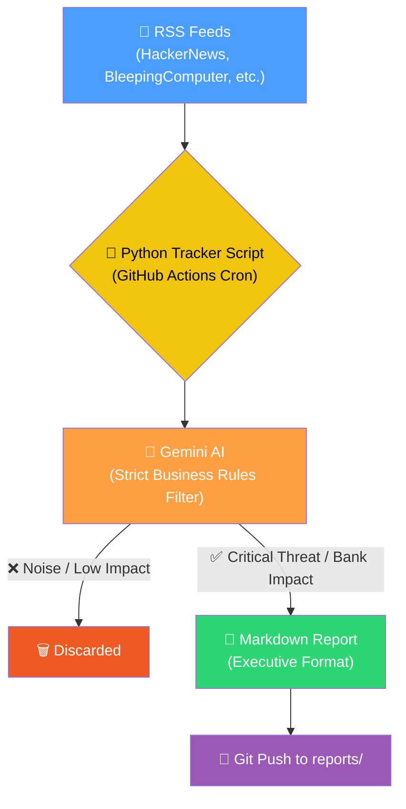

# 🛡️ Daily Threat Intel & Emerging Tech Tracker

> **Automated Threat Intelligence pipeline leveraging Gemini AI and RSS feeds to generate daily, executive-ready cybersecurity briefings.**

[](https://github.com/Thomas-LEON/news-tracker/actions)
[](https://www.python.org)
[](LICENSE)

---

## 🤔 The Problem

Threat Intelligence analysts face massive information overload daily. Hundreds of cybersecurity articles, vulnerability disclosures, and incident reports are published every 24 hours. Sorting through the noise to find what actually impacts a specific sector (like the financial industry) or involves critical emerging tech (AI, Cloud) is a massive time sink.

## ✅ What It Does

This tool automates the daily Threat Intel curation process. It runs autonomously every morning, scrapes the top cybersecurity RSS feeds, and uses **Google Gemini AI** with highly specific business rules to filter the noise and generate a structured **Executive Summary**.



---

## 🛡️ AI Filtering & Anti-Duplicate Engine

The LLM is explicitly prompted with **Strict Business Rules** to ensure extreme qualitative filtering:

| Inclusion Criteria (High Priority) | Exclusion Criteria (Noise) |
|---|---|
| **Financial Sector / Supply Chain:** Direct attacks on banks or IT providers. | **Small Scale:** Ransomware hitting local SMEs or hospitals. |
| **Big Tech / AI Leaders:** Any incident involving OpenAI, Azure, AWS, Anthropic. | **Consumer Breaches:** E-commerce or gaming databases. |
| **Critical Infrastructure:** Major CVEs on Windows, Linux, or Enterprise Networks. | **Generic Noise:** Background phishing campaigns. |

**Anti-Duplicate System:** The script automatically parses the past 3 days of generated reports and dynamically creates a blacklist to ensure the AI never writes about the same incident twice, even if RSS feeds push old articles.

---

## 🚀 Quick Start

### 1. Run Locally
```bash
git clone https://github.com/Thomas-LEON/news-tracker.git
cd news-tracker
pip install -r requirements.txt

# Export your API key
export GEMINI_API_KEY="your_api_key_here"

# Generate today's report
python news_tracker.py
```

### 2. Run Automatically (GitHub Actions)
The repository includes a `.github/workflows/daily-tracker.yml` that runs every morning.
1. Go to your repository **Settings** > **Secrets and variables** > **Actions**.
2. Add a repository secret named `GEMINI_API_KEY`.
3. The pipeline will automatically commit a new `.md` report to the `reports/` folder every day.

---

## 📁 Project Structure

```text
news-tracker/
├── .github/workflows/
│   └── daily-tracker.yml        # GitHub Actions CI/CD Pipeline
├── reports/                     # Auto-generated daily markdown reports
├── news_tracker.py              # Core logic & AI prompt engineering
├── requirements.txt             # Python dependencies
├── SOP.md                       # Standard Operating Procedure (Internal Docs)
└── README.md
```

---

*Built by [Thomas LEON](https://www.linkedin.com/in/thomas-leon-893316262/) · Emerging Technologies & Threat Intelligence*
