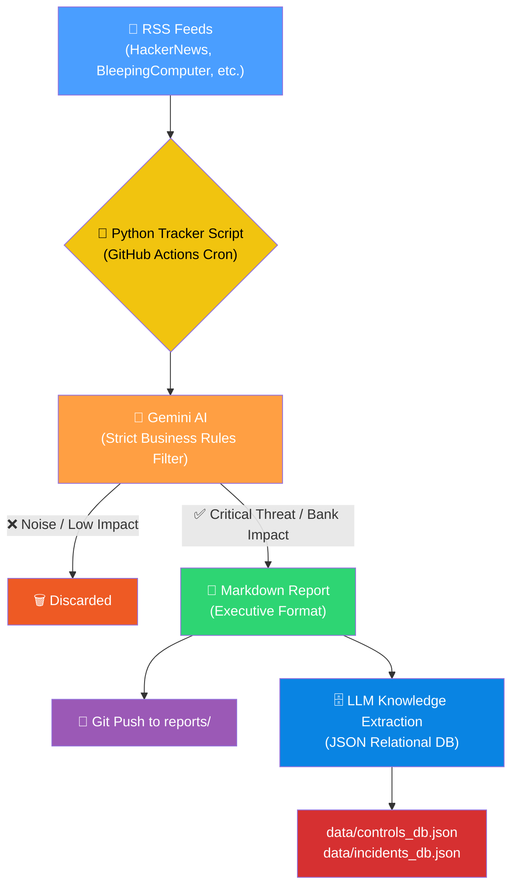

# 🛡️ Daily Threat Intel & Emerging Tech Tracker

> **Automated Threat Intelligence pipeline leveraging Gemini AI and RSS feeds to generate daily, executive-ready cybersecurity briefings.**

[](https://github.com/Thomas-LEON/news-tracker/actions)
[](#-engineering-standards--contributing)
[](https://www.python.org)
[](LICENSE)

---

## 🤔 The Problem

Threat Intelligence analysts face massive information overload daily. Hundreds of cybersecurity articles, vulnerability disclosures, and incident reports are published every 24 hours. Sorting through the noise to find what actually impacts a specific sector (like the financial industry) or involves critical emerging tech (AI, Cloud) is a massive time sink.

## ✅ What It Does

This tool automates the daily Threat Intel curation process. It runs autonomously every morning, scrapes the top cybersecurity RSS feeds, and uses **Google Gemini AI** with highly specific business rules to filter the noise and generate a structured **Executive Summary**.



---

## 🛡️ AI Filtering & Anti-Duplicate Engine

The LLM is explicitly prompted with **Strict Business Rules** to ensure extreme qualitative filtering:

| Inclusion Criteria (High Priority) | Exclusion Criteria (Noise) |
|---|---|
| **Financial Sector / Supply Chain:** Direct attacks on banks or IT providers. | **Small Scale:** Ransomware hitting local SMEs or hospitals. |
| **Big Tech / AI Leaders:** Any incident involving OpenAI, Azure, AWS, Anthropic. | **Consumer Breaches:** E-commerce or gaming databases. |
| **Critical Infrastructure:** Major CVEs on Windows, Linux, or Enterprise Networks. | **Generic Noise:** Background phishing campaigns. |

**Anti-Duplicate System:** The script automatically parses the past 3 days of generated reports and dynamically creates a blacklist to ensure the AI never writes about the same incident twice, even if RSS feeds push old articles.

---

## 🗄️ JSON Relational Control Center (V13 Architecture)

Beyond simply generating markdown files, the system extracts structured, actionable intelligence from every incident:
- **Semantic Control Deduplication:** A secondary AI pass analyzes the "Mitigating Controls" proposed in the report. It compares them against a local JSON database and assigns consistent IDs (`CTRL-NOUVEAU-XXXX` or reuses existing ones).
- **Relational Databases:** The intelligence is saved locally in `data/incidents_db.json` (tracking incidents over time) and `data/controls_db.json` (tracking defense mechanisms, their CIA impact, and prerequisites).

---

## 🚀 Quick Start

### 1. Run via Docker (Recommended for Production)
The easiest way to run the tracker locally or on a server without polluting your host environment is using Docker Compose.

```bash
git clone https://github.com/Thomas-LEON/news-tracker.git
cd news-tracker

# Create your environment file
cp .env.example .env
# Edit .env and add your GEMINI_API_KEY

# Run the tracker (generates reports/ and locks/)
docker-compose up --build
```

### 2. Run Locally (Python)
```bash
git clone https://github.com/Thomas-LEON/news-tracker.git
cd news-tracker
pip install -r requirements.txt

# Export your API key or add it to a .env file
export GEMINI_API_KEY="your_api_key_here"

# Generate today's report
python src/news_tracker.py
```

### 2. Run Automatically (GitHub Actions)
The repository includes a `.github/workflows/daily-tracker.yml` that runs every morning.
1. Go to your repository **Settings** > **Secrets and variables** > **Actions**.
2. Add a repository secret named `GEMINI_API_KEY`.
3. The pipeline will automatically commit a new `.md` report to the `reports/` folder every day.

### 3. Manual vs. Automated Generation — Lock File System

The script uses a **lock file system** to prevent the automated bot from ever overwriting a manually-generated report.

| Scenario | Behaviour |
|---|---|
| **Bot runs first** (6:00 AM), you haven't generated manually | Bot generates the report + creates `locks/.lock_YYYY-MM-DD` (origin: `bot`) |
| **You generate manually** at any point in the day | Script generates the report + creates/overwrites `locks/.lock_YYYY-MM-DD` (origin: `manual`) |
| **Bot tries to run** after a manual generation | Bot reads the lock file → immediately exits with `[SKIP]`. Your report is safe. |
| **You re-generate manually** after the bot already ran | Local run always bypasses the lock check (only the bot is blocked) → overwrites the bot's report. |

> [!IMPORTANT]
> Lock files live in the `locks/` directory and are committed to the repo. They are the source of truth for whether a report has been generated for a given day.

---

## 📁 Project Structure

```text
news-tracker/
├── .github/workflows/
│   ├── daily-tracker.yml        # GitHub Actions Bot Pipeline
│   └── ci.yml                   # CI Pipeline (Tests, Linting, Security)
├── src/
│   └── news_tracker.py          # Core logic & AI Gateway Router
├── data/
│   ├── controls_db.json         # Relational database of mitigating controls
│   └── incidents_db.json        # Relational database of tracked incidents
├── reports/                     # Auto-generated daily markdown reports
├── newsletters/                 # Auto-generated daily .eml email formats
├── locks/                       # Synchronization locks
├── tests/                       # Comprehensive Pytest suite
├── docker-compose.yml           # Production Docker setup
├── Dockerfile                   # Application image
├── .env.example                 # Environment variables template
├── requirements.txt             # Pinned Python dependencies
└── README.md
```

## 🏛️ Engineering Standards & Contributing
This project enforces strict engineering standards including mandatory branching strategies, conventional commits, automated CI pipelines, and a minimum of **80% test coverage**. 

Before contributing, please read the [CONTRIBUTING.md](CONTRIBUTING.md) guidelines.

---

*Built by [Thomas LEON](https://www.linkedin.com/in/thomas-leon-893316262/) - Emerging Technologies & Threat Intelligence*
