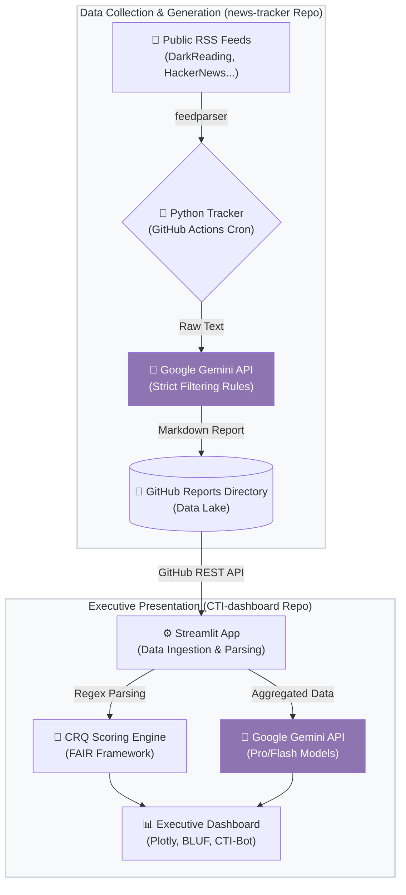

# End-to-End Threat Intelligence Pipeline Architecture

This document provides a technical overview of the automated Cyber Threat Intelligence (CTI) pipeline, detailing the data flow from raw internet sources to the executive dashboard. 

The architecture is split into two decoupled micro-services connected via a GitHub repository acting as a headless CMS/Data Lake.

## 🏗️ High-Level Architecture Diagram

---

## ⚙️ Phase 1: Data Collection & Generation (`news-tracker`)

This component operates autonomously as a scheduled background job, acting as the primary intelligence gatherer and initial qualitative filter.

### Workflow
1. **Trigger:** A GitHub Actions cron job (`daily-tracker.yml`) triggers the execution every morning.
2. **Scraping:** The `news_tracker.py` script uses the `feedparser` library to pull articles published in the last 24 hours from an array of pre-configured cyber-security RSS feeds.
3. **AI Filtering (Noise Reduction):** The raw articles are sent to the **Google Gemini API**. The LLM is constrained by strict business rules:
   - **Inclusion:** Financial sector impacts, Big Tech (Cloud/AI) vulnerabilities, critical infrastructure.
   - **Exclusion:** Generic phishing, non-strategic ransomware (SMEs), consumer data leaks.
4. **Report Generation:** The LLM structures the filtered intelligence into a highly formatted Markdown document. Crucially, the LLM is prompted to evaluate the FAIR framework vectors (Threat Capability, Event Frequency, Business Impact) and generate a quantitative Threat Score.
5. **Storage:** The script commits and pushes the generated Markdown file (`Daily_Threat_Intel_YYYY-MM-DD.md`) directly into the repository.

### Technical Stack
- **Python 3.10+** (beautifulsoup4, feedparser, httpx)
- **AI Model:** Google Gemini via the `google-genai` SDK.
- **Compute:** GitHub Actions Ubuntu Runners.

---

## 📊 Phase 2: Executive Presentation (`CTI-dashboard`)

This component is the UI layer. It is fully decoupled from the generation process and only consumes the structured Markdown files, ensuring rapid load times and stateless operation.

### Workflow
1. **Data Ingestion:** The `data/github_client.py` module queries the GitHub REST API to fetch the last 7 days of Markdown reports from the `news-tracker` repository.
2. **Regex Parsing:** The `analysis/parser.py` module uses compiled regular expressions to parse the Markdown. It extracts the raw text into structured Python `dataclasses` (Incidents) and extracts the FAIR Threat Score.
3. **Data Visualization:** The timeline of Threat Scores is passed to Plotly to render the 7-day historical baseline and current-day gauge chart.
4. **AI Synthesis (BLUF):** The raw text of the day's incidents is aggregated and sent to the **Google Gemini Pro API** to generate the "Bottom Line Up Front" (BLUF), synthesizing the strategic impact for C-Level executives.
5. **Interactive RAG (CTI-Bot):** The text from all 7 days of reports is loaded into the context window of a **Google Gemini Flash API** model, enabling the user to ask natural language questions about the recent threat landscape.

### Technical Stack
- **Python 3.10+** (Streamlit, Plotly, Pandas, requests)
- **AI Models:** Google Gemini Pro (Strategic BLUF) and Gemini Flash (Fast Chatbot).
- **Architecture:** Modular MVC-inspired structure (Data, Analysis, AI, UI layers).
