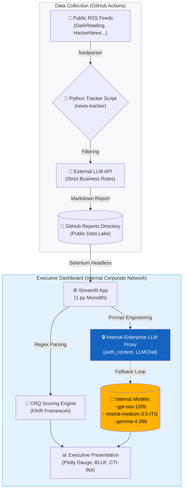

# End-to-End Threat Intelligence Pipeline Architecture (Internal Version)

This document provides a technical overview of the automated Cyber Threat Intelligence (CTI) pipeline, detailing the data flow from raw internet sources to the executive dashboard deployed within the internal corporate environment.

The architecture connects an external intelligence generation pipeline to an internal consumption dashboard.

## 🏗️ High-Level Architecture Diagram

---

## ⚙️ Phase 1: External Data Collection & Generation

This component operates autonomously on the public web, acting as the primary intelligence gatherer and initial qualitative filter.

### Workflow
1. **Trigger:** A scheduled job runs the script every morning.
2. **Scraping:** Uses the `feedparser` library to pull articles published in the last 24 hours from an array of pre-configured cyber-security RSS feeds.
3. **AI Filtering:** Raw articles are processed using strict business rules to exclude noise (e.g., standard ransomware on SMEs) and include critical threats (e.g., Cloud, AI, Financial sector).
4. **Report Generation:** Generates a highly formatted Markdown document (`Daily_Threat_Intel_YYYY-MM-DD.md`) containing the FAIR-based Threat Score and detailed incidents.
5. **Storage:** The Markdown file is pushed to the `reports/` folder of the GitHub repository.

---

## 📊 Phase 2: Internal Executive Dashboard (The `1.py` App)

This component is the UI layer running within the internal corporate perimeter. It is designed to safely ingest external data and process it using **exclusively internal, compliant AI models**.

### Workflow
1. **Data Ingestion (Selenium Bypass):** To navigate internal corporate proxies and retrieve data from GitHub, the `fetch_recent_reports` function utilizes `selenium` with a headless Chrome browser. This safely fetches the last 7 days of Markdown reports without tripping standard HTTP blockers.
2. **Regex Parsing & CRQ Extraction:** The Markdown is parsed using compiled regular expressions to extract structured incident data and the quantitative FAIR Threat Score.
3. **Internal AI Synthesis (BLUF & CTI-Bot):** 
   - **No Public APIs are used.** The application utilizes the internal LLM library (`llm.get_auth_context`, `llm.LLMChat`).
   - The app implements a **resilience loop**: It attempts to reach multiple internal enterprise models sequentially (`gpt-oss-120b`, `mistral-medium-3.5-ITG`, `gemma-4-26b`) to generate the Executive Summary (BLUF) and power the interactive chat. If one model fails or is overloaded, it automatically falls back to the next.
4. **Data Visualization:** Plotly is used to render the 7-day historical baseline (Trend Line) and the current-day Threat Score (Gauge Chart).

### Technical Stack (Internal Environment)
- **Frontend/Backend:** Python 3 (Streamlit, Plotly, Pandas)
- **Ingestion:** Selenium WebDriver (Headless Chrome)
- **AI Infrastructure:** Internal Corporate LLM Proxy (`llm` module)
- **Architecture:** Monolithic Streamlit script (`1.py`) combining UI, scraping, parsing, and LLM calls.
